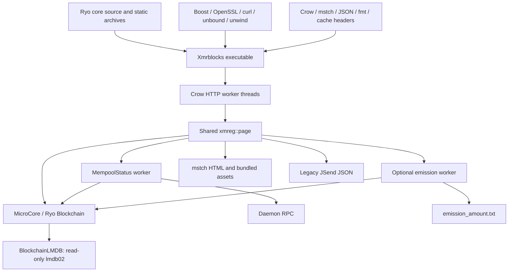

# Current architecture

**Scope:** This document inventories the inspected official upstream explorer.
The active project contains selected native C++ components only; its source
boundary is described in [IMPORT_SCOPE.md](IMPORT_SCOPE.md). The legacy HTTP
server, website, and routes below are not shipped by this foundation.

Discovery date: 2026-10-04. Explorer source: official upstream
`2e334724f9921e813e787b09f9365d53020a6286` (2025-08-04), with 970 reachable
commits and a non-shallow clone. This document describes source behavior, not a
claim that every path has passed runtime testing. See [validation status](PHASE0_REPORT.md).

## Repository and build graph

```text
main.cpp                         startup, Crow routes, HTTP responses
CMakeLists.txt                   C++14 executable xmrblocks, Ryo/system linking
src/
  MicroCore.{h,cpp}              Ryo Blockchain and tx_memory_pool owner
  monero_headers.h              Ryo headers (historical Monero filename)
  page.h                        HTML, JSON, chain interpretation, caches
  tools.{h,cpp}                 parsing, formatting, crypto/wallet helpers
  rpccalls.{h,cpp}               epee HTTP/JSON daemon client
  MempoolStatus.{h,cpp}          shared local-pool/network snapshots
  CurrentBlockchainStatus.*     optional emission scanner/checkpoint
  CmdLineOptions.*              Boost command-line configuration
  templates/                    mstch pages, partials, bundled JS/static assets
ext/                            Crow, mstch, JSON, CSV, cache headers
cmake/                          Ryo library discovery, version/template helpers,
                                optional sanitizer discovery
```

The original tree has no application tests, CI workflows, Docker packaging, or
developer scripts. `ext/mstch` exposes test options, but its referenced test
directories are absent; this is not an available explorer test suite. The
original `.gitignore` ignores `tests/` and needs adjustment when tests are added.



The CMake variables are still called `MONERO_DIR`, `MONERO_SOURCE_DIR`, and
`MONERO_BUILD_DIR`, but must point to Ryo, not current Monero. The default source
path `~/monero` is unsuitable for Ryo. The expected Ryo build path defaults to
`build/release`. `cmake/FindMonero.cmake` creates imported static-library targets;
it does not currently provide a robust missing-library diagnostic. `ext/`
compiles fmt sources from the external Ryo checkout. Exact core revision, build
options, generated headers, and static archives therefore matter together.

Linked libraries include `wallet`, `blockchain_db`, `cryptonote_core`,
`cryptonote_protocol`, `cryptonote_basic`, `multisig`, `daemonizer`, `cncrypto`,
`lmdb`, `ringct`, optional `ringct_basic`, `device`, `common`, `mnemonics`,
`checkpoints`, `version`, and `epee`. System linkage includes the selected Boost
components, pthread, unbound, curl, crypto, ssl, atomic, unwind, and dl on Linux.
Newer Ryo library dependencies must be verified by a real link attempt.

## Startup and processes

`main.cpp` parses options, rejects simultaneous testnet/stagenet, checks optional
TLS files, resolves the chain directory, and initializes `MicroCore`. It then
starts the optional emission worker, always starts `MempoolStatus`, constructs
one `page`, registers routes, and runs Crow with `.multithreaded()`.

Crow serves one shared `page` from multiple HTTP threads. On shutdown, startup
code interrupts and joins the Boost background threads. Some dashboard work is
also launched with `std::async`, including network information and mempool
rendering; `--mempool-info-timeout` defaults to 5,000 milliseconds. Blocking
future destruction and RPC timeout behavior require runtime measurements.

## Chain and LMDB access

`MicroCore` owns mutually dependent Ryo `tx_memory_pool` and `Blockchain`
objects. It allocates a `BlockchainLMDB`, opens it with `MDB_RDONLY | MDB_NOLOCK`,
and passes it to `Blockchain::init`. This process is not another mining daemon.
It reads the same chain schema using native Ryo objects and indexes.

`tools.cpp::get_default_lmdb_folder` uses Ryo's default data directory, adds
`testnet` or `stagenet` as appropriate, and appends `lmdb02`. Prefer an explicit
`--bc-path` during validation; README examples referring to `lmdb` are stale.
The explorer must read a database compatible with its linked Ryo revision.
`MDB_NOLOCK` means synchronization assumptions with the daemon need explicit
review, including mapping growth and reorg consistency. Read-only opening alone
does not prove safe concurrent operation.

Block/transaction reads, output global-index resolution, input rings, key-image
spent checks, and coinbase inspection use Ryo chain/library calls. Helpers can
find an output key within a specified block; that is not a complete arbitrary
output-public-key reverse index. HTML search decodes address metadata but does
not supply address balance/history. The old custom search-index path is disabled.

## Daemon RPC

`rpccalls` wraps epee's HTTP client and uses a per-instance mutex. Its default
timeout is 200,000 milliseconds. Calls include `/getheight`,
`/get_transaction_pool`, `/sendrawtransaction`, JSON-RPC `get_info`,
`hard_fork_info`, and `getblock`; the alternate-block wrapper is conditional on
the linked Ryo response type. Wrapper existence does not imply an active route.

`MempoolStatus::read_network_info` calls `get_info` and `hard_fork_info`.
It derives estimated hashrate as difficulty / target, copies node connection
counts, and stores a snapshot. The fee estimate is hard-coded to 500,000 atomic
units. Node-local connection/peer counts are not network-wide totals.

The CLI option is misspelled `--deamon-url`; retain it for compatibility.
Defaults use `http:://` (two colons), with ports 12211/13311/14411 selected by
network. Pass a correctly formed explicit URL in development; investigate
default parsing before changing it.

## Mempool and network snapshots

Contrary to RPC-related comments, `read_mempool` calls
`mcore->get_mempool().get_transactions_and_spent_keys_info`. The Ryo local pool
uses the underlying chain database. It validates blobs through Ryo parsing,
sorts by node-local `receive_time`, constructs metadata, and publishes a complete
vector under `mempool_mutx`. Readers obtain copies under the same mutex.
Counts and total size use atomics; the misleading `mempool_size_kB` variable and
`tx_pool_size_kbytes` API name actually carry a sum of `blob_size` bytes.

Pool refresh defaults to five seconds (clamped to at least one). Network refresh
occurs every `max(1, 60 / refresh_interval)` iterations plus work time. RPC
failure marks the network snapshot non-current. A pool read failure retains the
last successful pool contents without an equivalent freshness flag.
`current_network_info` is a large atomic struct and needs libatomic on Linux.
Separate atomic/vector reads are not one transactionally consistent snapshot.

Node-local receive timestamps appear in pool HTML/API and transaction lookup
fallbacks. See [the privacy model](PRIVACY_MODEL.md) before designing v2 DTOs.

## Emission

`CurrentBlockchainStatus` is optional (`--enable-emission-monitor`). It sums
coinbase output amounts minus transaction fees through Ryo helpers; fee totals
are tracked separately. At genesis, if the amount is `8800000000000000`, it
substitutes `99948553572999` atomic units. Preserve and test this exact behavior;
the README's rounded burn description is not the complete arithmetic.

The worker processes 10,000-block chunks, sleeps one second during catch-up and
60 seconds near the tip, and keeps a three-block gap. `get_emission` can calculate
the remaining tip blocks on demand. It saves `height,coinbase,fee,checksum` to
`<bc-path>/emission_amount.txt`; the checksum is an additive integrity check.
The checkpoint has no chain hash or network identity. Writes truncate the file
and are not atomic. Do not run multiple emission writers for the same path.
Deep reorg rollback, incomplete reads, small-chain unsigned subtraction, corrupt
checkpoints, and worker lifecycle need fixture/integration tests. A corrupt
checkpoint can trigger an interactive `cin.get()` at startup.

The official Ryo core contains development-fund constants, a public fund
view-key declaration, and emission-curve tests. This is evidence to investigate,
not proof of a complete fund accounting product. No such feature is implemented
here, and schedule totals must not be described as actual spending/balances.

## Rendering, assets, browser verification

`page.h` (6,745 lines at discovery) builds mstch maps, renders templates, performs
chain queries, and constructs JSON. Templates and JavaScript are read into a
map at startup. Changes require restarting the process. Paths are relative to
the working directory (`./templates`); run from the build/install directory.

An explicit `/static/style.css` handler returns stored CSS, while Crow also
registers `/static/<path>` rooted at `static/`. Upstream copied assets only to
`templates/static/`, causing local logo/icon requests to return 404. The baseline
copies/installs both locations and checks delivery independently of page HTML.
The header includes images and links to optional tools even when disabled.

`--enable-js` serves bundled jQuery, CRC32, big integers, NaCl/CryptoNote helpers,
base58, SHA3, and configuration. `all_in_one.js` is concatenated at startup.
Network flags modify configuration for testnet/stagenet. The individual
`cn_util.js` route and concatenated bundle use the same populated map key.
Capture both paths in smoke tests.

`partials/tx_details.html` changes decode/prove buttons to browser handlers when
JS is enabled. Handlers operate on embedded public transaction JSON and private
inputs locally, including output-key derivation, amount decoding, encrypted
payment IDs, and additional public/private keys. Historical/version coverage,
uniform-payment-ID parity, and subaddress correctness require real fixtures.
This existing JS is not a reason to rewrite Ryo crypto during modernization.
Server decode/prove routes remain registered even when browser mode is enabled.

Autorefresh is a ten-second HTML meta refresh behind a flag. No SSE/WebSocket
event stream, modern SPA, analytics store, or API v2 exists.

## Caches and reorg assumptions

Optional caches: FIFO of 200 block-height transaction contexts, LRU of 1,000
transaction contexts keyed by hash and the ring-details flag. Request-time
fields such as age/confirmations are refreshed. Cached blocks validate transaction
presence/height and can clear the block cache on inconsistency. Cached transaction
contexts can rebuild for chain/pool transitions. These checks do not establish
an atomic chain snapshot or complete hash-based reorg invalidation.

The vendored cache uses `operation_guard{safe_op};` as a temporary: the mutex is
released at the end of that statement, before container access. `Get` also returns
a reference and callers use `Contains` followed by `Get`. A complete concurrency
fix needs a tested access/copy strategy; merely naming the guard does not fix all
lifetimes. Keep caches disabled during initial baseline validation and record
enabled-cache stress/reorg tests before proposing a behavioral repair.

## Licensing and compatibility boundaries

Preserve the root BSD-3-Clause notice, mstch MIT notice, vendored source notices,
and the GPL notice in the inherited CMake discovery helper. Keep linked Ryo and
bundled JavaScript attribution visible; this inventory is not a license audit.
Routes and legacy schemas are catalogued in [the feature matrix](FEATURE_MATRIX.md)
and [legacy API reference](API_LEGACY.md). Historical names, units, null values,
HTTP behavior, and optional feature gates are compatibility risks.
