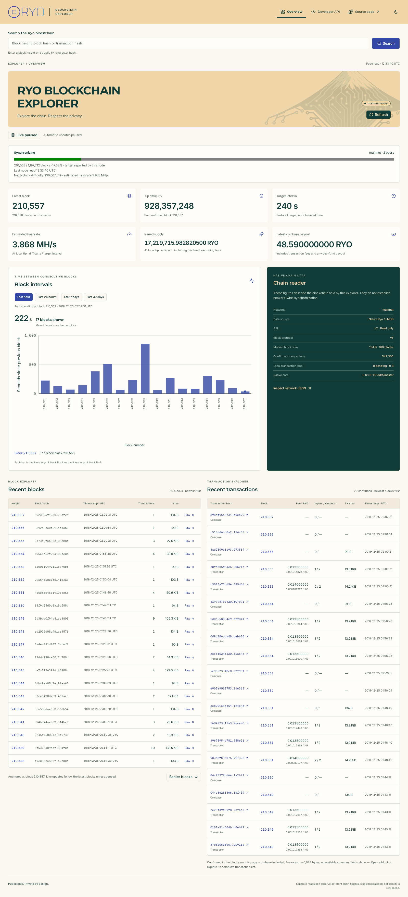

# Dashboard comparison with explorer.ryo.tools

Reviewed on 2026-10-06. The owner supplied
[explorer.ryo.tools](https://explorer.ryo.tools/) as the reference for the new
dashboard. This audit compares its public interface and available source with
our implementation; it does not establish who operates that deployment.

## Observation and scope

A fresh HTML response reported server time `2026-10-06 12:02:58`, network height
`1197703`, newest block `1197702`, difficulty `63526812`, estimated hashrate
`264.695 kH/s`, protocol v9 and a rounded supply label of `63321700 RYO`.
These are dated observations, not constants or expected values for our reader.
An earlier search response contained older data; the fresh response was used
for comparison. Later page reads can legitimately differ.

The reference's API links returned an authorization-required response, including
HTML bodies on nominal HTTP 200 responses. Consequently, this audit cannot
claim direct API parity or independently verify its displayed supply total.
Public implementation definitions were inspected in the
[upstream explorer source](https://github.com/ryo-currency/ryo-blockchain-explorer),
including `src/page.h`, `src/MempoolStatus.cpp` and
`src/CurrentBlockchainStatus.cpp`. No legacy templates, styles or scripts were
imported. Existing Ryo branding and both dashboard tables are preserved.

## Information comparison

| Information | Before this revision | Implemented result / remaining difference |
| --- | --- | --- |
| Height | Latest block and reader block count | Retained both, with explicit meanings. Genesis is block 0; a chain ending at N contains N + 1 blocks. |
| Difficulty | Confirmed tip difficulty | Label now identifies its block. Optional node panel separately reports next-block difficulty, matching the reference's definition. |
| Hashrate estimate | Missing | Added difficulty / native target interval at the local tip; optional node panel also estimates from next-block difficulty. Neither is an observed measurement of all miners. |
| Supply | Missing | Added exact issued supply at the local tip, including native dev-fund issuance and excluding transaction fees. Spendable circulating supply is not inferred. |
| Coinbase payout | Available through transaction detail | Added latest public coinbase payout, explicitly including fees and any dev-fund payment. It is not labeled subsidy alone. |
| Protocol and software | Versions available in network JSON | Dashboard now shows tip block protocol and linked native core version. These describe our reader, rather than the reference deployment or a separate daemon. |
| Time and synchronization | Page/live-check UTC times; reader height alone | Retained timestamps and added an optional node connection panel: sync counts, target, progress, peer count and observation time. |
| Median block size | Missing | Added native median size over the last 100 blocks, or the actual smaller sample on a short chain. |
| Confirmed transactions | Recent bounded preview | Retained preview and added total confirmed ordinary transaction count, excluding coinbase. |
| Mempool | Known transaction detail by hash only | Added relayable local pool count/size and `/mempool` with full bounded pagination, aggregate fees and membership-aware live updates. |
| TX fee, size and inputs/outputs | Exact fee in preview; remaining metadata in detail | Preview now includes native size, input/output counts and exact fee per KiB when already available from its bounded block-detail reads. Header-only coinbase rows show unavailable fields as a dash. |
| Ring size and payment-ID marker | Available in transaction details | Now included in dashboard, block and pool summaries through native `inspection`, without extra per-transaction lookups; uniform/encrypted presence is explicit. |
| Address / verification / submission tools | Height/hash search and public metadata inspection | Added `/tools` for native public-address parsing, confirmed key-image membership and output-key membership within a transaction. Secret-based verification/export checks and submission remain outside this release. |
| Interval history and JSON | Native windows and embedded exact JSON | Preserved our additional chart, inspection hold, live recovery, readable details and contextual JSON views. |

## Correctness findings

**Difficulty values were not wrong, but referred to different blocks.** The
reference uses daemon `get_info` difficulty for the next block. Our existing
LMDB metric described the last confirmed block. Both remain useful and are now
distinguished. Hashrate uses integer arithmetic with three displayed decimals;
for the reference's observed inputs, `63526812 / 240` displays `264.695 kH/s`.

**Reader height must not be presented as current network height during sync.**
The local smoke reader was around block 210,557, dated December 2018, while the
reference was around 1,197,702 in October 2026. Different difficulty, protocol,
supply and payout values at those heights do not show a calculation error.
The new panel makes historical synchronization visible. Its target and peers
are reported by the configured node, not independently verified consensus.

**The native emission counter alone would undercount issued coins.** In the
[pinned Ryo core](https://github.com/ryo-currency/ryo-currency/tree/185dd1fa33ba88c88bb22df9069ad368c0f9a27e),
`Blockchain::validate_miner_transaction_v2` excludes dev-fund outputs from the
base reward stored in `already_generated_coins`. The new overview adds eligible
native dev-fund payments using `get_dev_fund_amount` and stored hard-fork
versions. It does not duplicate the payout formula or scan every transaction.
Fees transfer existing coins and are excluded from issuance. If the native
counter has reached its accounting cap, issued supply is unavailable rather
than pretending the capped counter is a complete total.

**“Circulating” is a stronger claim than public data supports.** Issued coins
do not reveal which funds are lost, locked or still spendable. We therefore use
“Issued supply”, preserve all nine decimals and identify the local tip.
Similarly, a coinbase output sum includes fees and possible dev-fund payments;
calling it a mining subsidy would be misleading.

**Pool and transaction units need explicit scope.** A local pool can be empty
while another explorer has pending transactions, particularly during sync.
Our public aggregate excludes native entries marked `do_not_relay`, has a
10,000-entry scan bound and returns unavailable metrics if incomplete. It does
not expose receive times or peer/source records. KiB means exactly 1,024 bytes;
fee rates truncate to an atomic unit using BigInt, not floating-point money.
Hidden RingCT amounts remain unknown, including on transaction details.

## Implementation and compatibility

The existing native `NetworkService` reads an additive `overview` object in one
LMDB read scope. No new endpoint, auxiliary store, full-chain emission scan or
mandatory daemon dependency was added. Existing fields and legacy responses
remain unchanged. Older network responses without `overview` still work in the
frontend. Consumers validating against the old closed OpenAPI schema must
update that schema to accept the new optional property.

The optional server-only `RYO_DAEMON_RPC_URL` performs a fixed GET `/get_info`,
with a five-second deadline, 64-KiB body cap and the shared 16-read process bound.
Only selected public values are rendered; the internal URL and unselected RPC
fields never become a browser API. Unsafe numeric JSON integers and mismatched
networks are rejected for display. A failed read may retain a successful public
observation for at most 60 seconds, explicitly marked delayed with its original
UTC time. Otherwise the panel reports unavailable. This is a single transient
process-local observation, not a persistent chain cache.

Latest dashboards check native tip and pool metrics every ten seconds. A changed
tip/network or pool count/size refreshes the dashboard. Node status is read on
page refresh, not polled independently; pool membership changes with identical
count and size do not trigger a refresh. Pause and hidden-tab behavior remain.
Independent reader/list/node requests need not describe one shared instant.

## Evidence and remaining work

- The incremental Ubuntu 24.04 native build and all five native/schema/HTTP
  checks passed. Coverage includes genesis amounts, native dev-fund boundaries
  and increase, inactive-fork exclusion, public pool size and do-not-relay
  exclusion, median sampling and confirmed ordinary counts.
- Sixteen Node checks and fourteen production Chromium scenarios passed,
  including exact hashrate/fee arithmetic, optional DTO compatibility, RPC
  number/privacy validation, pool-only refresh, delayed node reads and network
  mismatch handling. Existing chart, live, search and accessibility checks pass.
- Real mainnet browser evidence at block 210,557 shows synchronization progress,
  two peers, six metric cards and both tables, with no page errors, external
  browser origins or mobile document overflow. Independent native API reads
  at block 210,917 recomputed the last-100 median (`13706` bytes) and summed
  coinbase outputs (`48621000000` atomic units), both matching the overview.

The owner authorized the remaining public listing/inspection work after this
initial comparison. `/mempool` now traverses relayable entries through bounded
membership cursors and handles changes/empty/unavailable states. Native summary
inspection adds ring ranges and all three payment-ID presence types. `/tools`
checks public key images, transaction output membership and address formats,
with direct links from detail pages. Native and browser evidence is recorded in
[V0_4_VALIDATION.md](V0_4_VALIDATION.md). These public tools are not the legacy
secret-based wallet-export checks. Private-key/output verification and transaction
submission remain separate capabilities outside the read-only public scope.

The reference footer advertises core `0.6.3.99-release/dev-github-actions`; our
unchanged pin reports `0.6.1.0-185dd1f/master`. A version-string difference is
not itself proof of incompatible interpretation, but current-tip parity and
full-chain synchronization have not been validated. This revision makes no
full-tip or full-load claim and does not silently change the core dependency.
