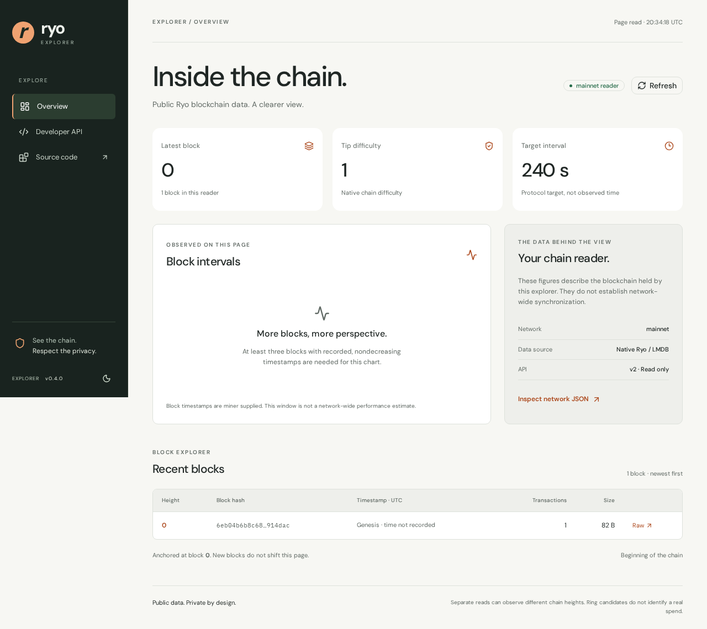
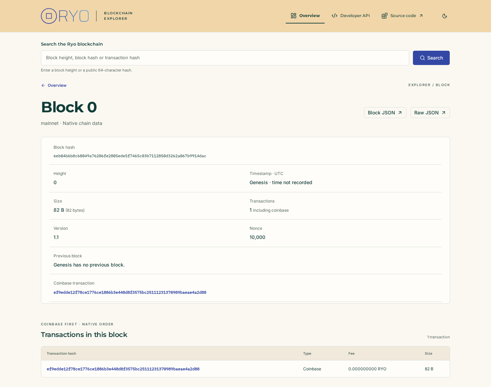
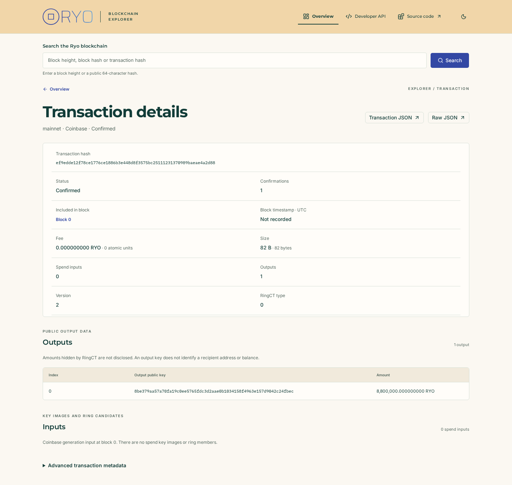
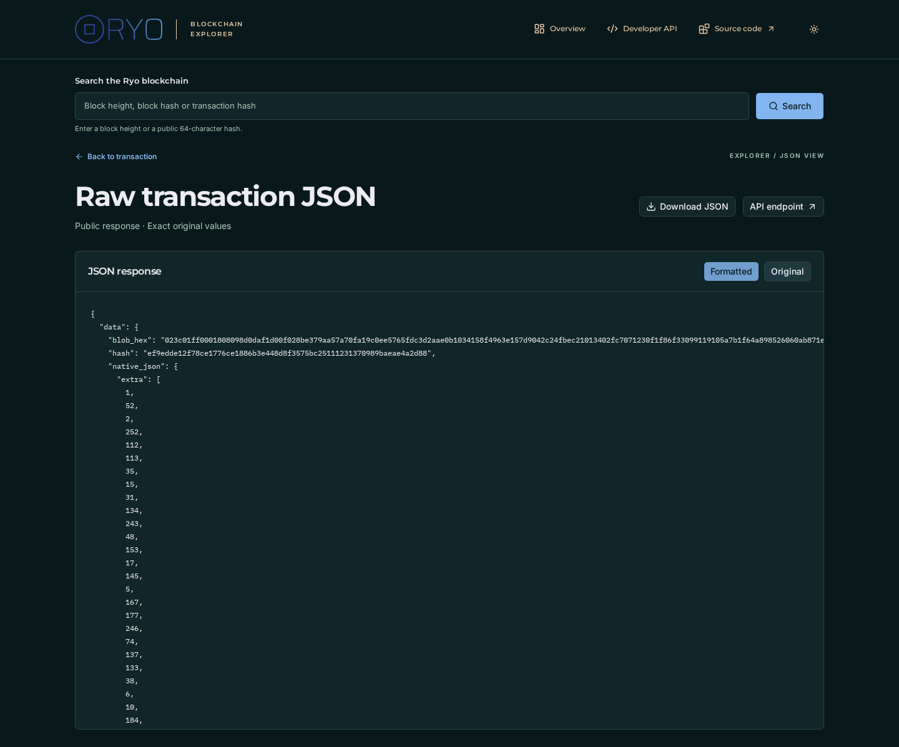
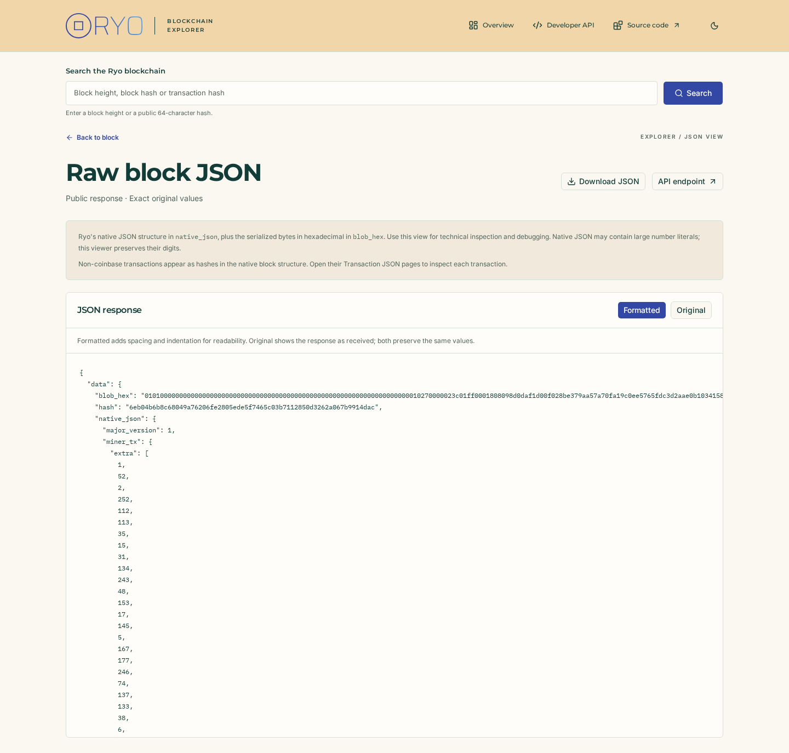
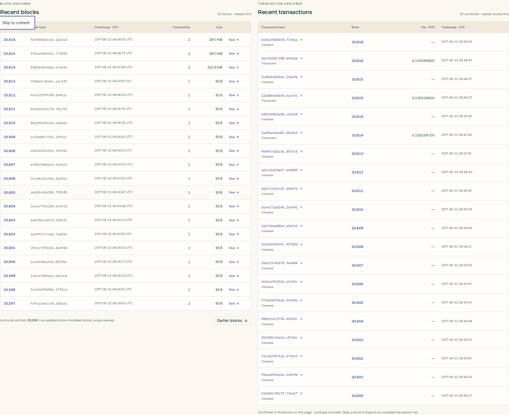
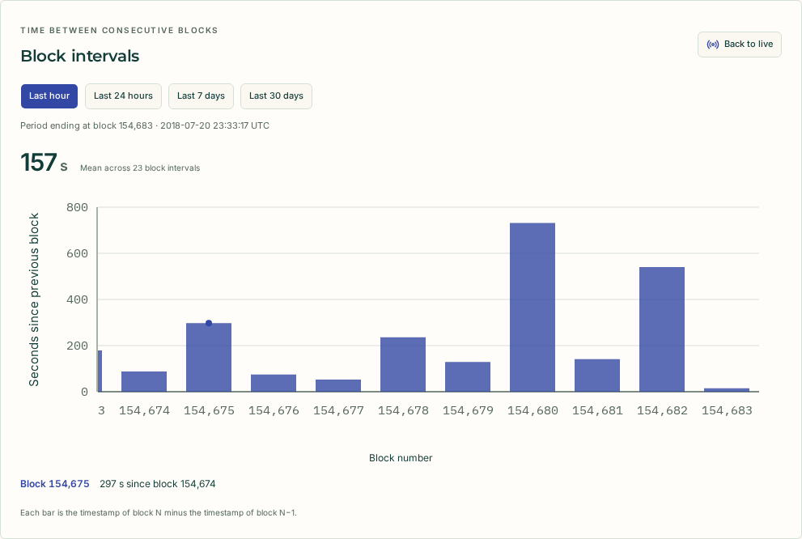
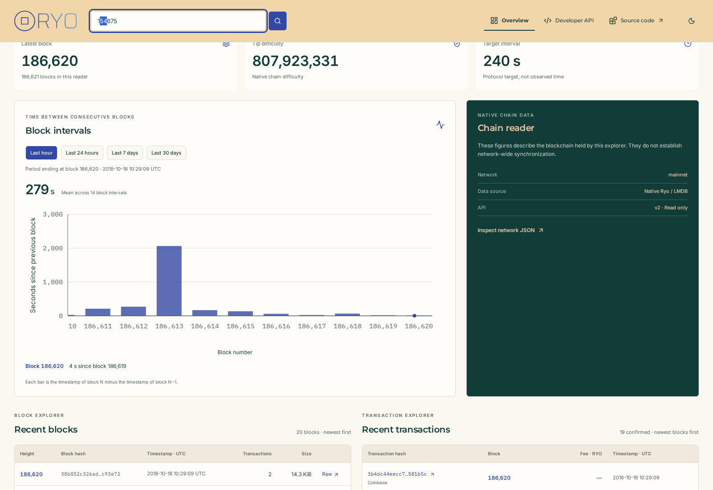
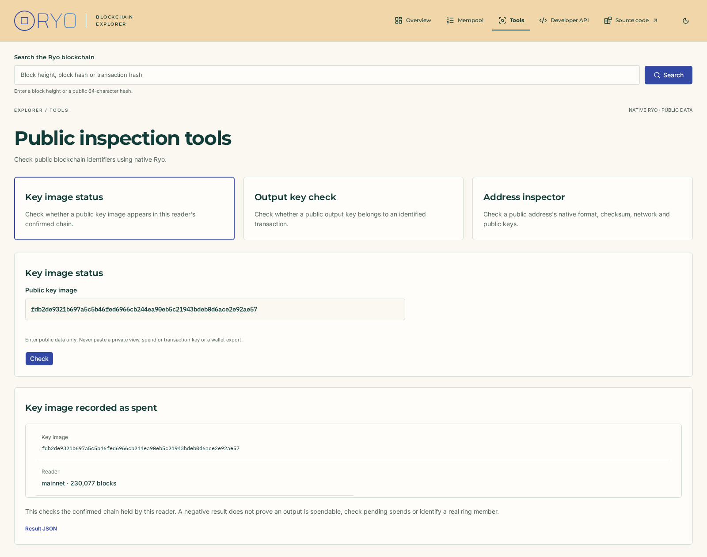
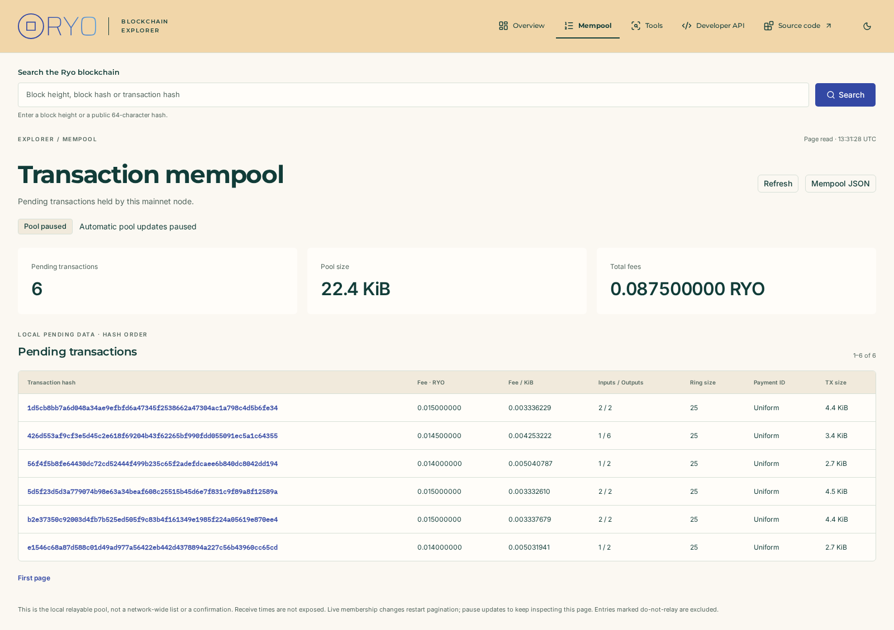

# v0.4 validation evidence

Recorded 2026-10-05 (UTC). This report covers the v0.4 web implementation, not
full-chain production capacity. Release publication is a separate owner-authorized
step; the prepared release notes are in [releases/v0.4.0.md](releases/v0.4.0.md).

## Native foundation and compatibility

The pinned official core remains `185dd1fa33ba88c88bb22df9069ad368c0f9a27e`, with
the existing isolated Ubuntu 24.04 compatibility patch. The native implementation
changes are product/OpenAPI metadata from 0.3.0 to 0.4.0 and an additive bounded
timestamp-window method/route on BlockService. Core pin, cryptographic
interpretation, read-only LMDB access and existing route contracts are preserved.

The HTTP/benchmark-enabled build passed in the established Ubuntu 24.04 PRoot
environment (GCC 13, Boost 1.83, OpenSSL 3), using the real pinned core archives.
All five CTest checks passed in 26.93 seconds with the interval-window extension:

| Check | Result |
| --- | --- |
| Native mainnet genesis | Passed, 1.04 s |
| Offline native LMDB/RPC | Passed, 3.46 s |
| Native historical/RingCT/services/reorg/schema responses | Passed, 4.48 s |
| OpenAPI/DTO schema and examples | Passed, 0.42 s |
| Real HTTP v2/legacy/flags/bounds/concurrency/shutdown | Passed, 17.51 s |

Local logs: `build/v04-interval-native-build.log` and
`build/v04-interval-native-tests.log` (ignored build artifacts). Native fixtures
retain their documented synthetic-storage and consensus/signature limitations.
The full native GitHub Action remains manual-only; no per-PR full build is added.
The owner-authorized manual [native run 37370952211](https://github.com/ucrem/ryo-blockchain-explorer/actions/runs/37370952211)
also passed on the implementation commit `7284564bca0f1608193e159127badc3e8b9c7589`.
That manual run validates the foundation before the timestamp-window extension;
the extended native sources and route are covered by the local checks above.

## Frontend build, resource and precision checks

The host frontend environment is Ubuntu 26.04, Node.js 24.21.0 and npm 11.19.0.
The production build uses Next.js 16.3.8, React 19.2.8, TypeScript 5.9.3 and
Tailwind 4.3.3. Registry-resolved dependencies are pinned in the npm lockfile.

- Clean lockfile installation succeeded; no API was needed at build time.
- ESLint, route generation/TypeScript checks and the production build passed.
- Fifteen Node tests passed: public native schema examples, exact values above
  2^53 and uint64 bounds, invalid/secret route queries, timestamp interpretation,
  trusted origins, raw numeric-token preservation, reorg status, redirect/content
  type/declared and streamed response-size rejection, concurrency and deadline.
  Detail cases cover count/inclusion consistency, hidden RingCT amounts, exact
  RYO formatting, public identifier normalization and bounded row pagination.
  JSON cases cover token preservation (including uint64, decimal spelling,
  exponents, negative zero, escapes and duplicate keys), malformed syntax and
  preview size/depth/expansion bounds.
  The dashboard transaction case verifies bounded block-detail fan-out and row
  count, no detail reads for coinbase-only headers, exact fees and rejection of
  failed or mismatched block snapshots.
  Interval cases verify exact signed deltas and predecessor continuity, malformed
  DTO rejection, integer-preserving axes above 2^53, zero/negative ticks, visible
  isolated points without lines across missing heights and bounded query shapes.
- Production dependency audit reported zero vulnerabilities. The complete audit
  reported five high entries, all one developer-only `braces` advisory and its
  Next ESLint glob dependency chain. The advisory has no published patched version:
  [GHSA-vfj7-8cjw-p6xm](https://github.com/advisories/GHSA-vfj7-8cjw-p6xm).
  It concerns attacker-supplied nested glob patterns in lint tooling, not runtime
  visitor input. No downgrade or unreviewed dependency override was applied.

## Production browser checks

Ten Chromium Playwright scenarios passed against the production Next server
in 33.5 seconds with the official-brand detail/search/JSON/live UI. Their isolated fixture
server uses explicitly synthetic headers and public genesis examples; it is never
imported by application code.

The scenarios cover exact displayed difficulty/height beyond JavaScript's safe
integer range; raw numeric text; no-store and rejected writes/private-key query
shapes; theme persistence; desktop light/dark and mobile accessibility checks;
no page-level horizontal overflow; native cursor navigation; 409 restart;
mobile developer navigation; keyboard skip link; backend outage and genesis empty
states; invalid page parameters; no hydration/page errors; and browser requests
restricted to the website origin. Additional scenarios cover HTML block/transaction
navigation, height/block-hash/transaction-hash searches, uppercase hash
normalization, exact fees, hidden output amounts, mempool inclusion, output-row
pagination, rejected duplicate/unsupported queries without native reads, absent
resources and partial reader outages. JSON checks cover retained layout, exact
formatted/original tokens, escaped markup without execution, verbatim downloads,
light/dark/mobile accessibility and rejected private queries without native reads.
Detail tables and JSON panels scroll with keyboard focus.
The live scenario verifies exact heights above 2^53, a refreshed tip/list without
losing a search draft or scroll position, no refresh for unchanged tips, paused
polling, outage retry with retained data and no polling on earlier cursor pages.
The paired-table scenario checks full viewport width at 1,920 px, side-by-side
panels, stacked mobile layout without page overflow, native fee precision,
coinbase labels/detail links and isolated transaction failures/network mismatch.
The live scenario also verifies that the transaction table follows the new tip.
The chart scenario verifies block/seconds axes, all four period selections,
large exact block labels, keyboard inspection, negative differences, point links,
partial-coverage messaging and desktop light/dark/mobile accessibility. Selected
historical periods persist and reload their anchor during live refresh.
The existing JSON browser scenario passed again in 4.4 seconds, including
light/dark/mobile accessibility. Production build and ESLint also passed. Native
genesis pages were inspected to confirm explanations are absent from primary
block/transaction pages and appear only for the selected JSON/raw view. The format
note follows the selected Formatted or Original mode.
Axe reported no violations in the tested
states; that is not a substitute for broad manual assistive-technology testing.

The minimal host lacked Chromium's shared libraries, fontconfig and fonts.
Required Ubuntu packages were downloaded/extracted under `/tmp/ryo-v04-browser`
without root installation; its library path/fontconfig were supplied only to
local browser tests. The website bundles its fonts and makes no font-CDN request.
These local environment paths are not app/runtime dependencies.

## Real native end-to-end smoke

A pinned `ryod --offline` created a separate genesis-only database under
`build/v04-native-smoke/chain`. The real v0.4 C++ HTTP executable opened it
read-only with API v2 enabled. The production Next server used that fixed API
origin. `web/tests/native-smoke.ts` passed in Chromium:

- Dashboard showed block zero and the truthful missing-timestamp/interval state.
- Actual reader height was `"1"`, the native tip hash was
  `6eb04b6b8c68049a76206fe2805ede5f7465c03b7112850d3262a067b9914dac`,
  and product version was `0.4.0`.
- Same-origin raw block returned native serialized hex and the expected hash;
  bundled OpenAPI reported 0.4.0.
- Block links opened readable native header/transaction HTML pages. The native
  coinbase output showed exactly `8,800,000.000000000 RYO`; height zero and both
  hash types resolved through the search field.
- Native raw transaction JSON opened inside the explorer layout. The original
  toggle matched the API response text exactly; formatted digits were preserved.
- No browser page errors or external-origin requests occurred.

Only the smoke's own loopback processes and offline directory were used; processes
were stopped afterward. No supplied chain, wallet, private keys, mainnet sync or
transaction submission was involved. An actual native-genesis screenshot is
included below; multi-block browser screenshots use synthetic test headers.

The replacement UI was inspected against the current official Ryo site in both
light and dark modes. Its actual wordmark, favicon and decorative artwork have
recorded [branding provenance](WEB_BRANDING.md). Inter/Montserrat are self-hosted;
the official site's Neue Kaine display font is not redistributed.

## Limited mainnet sync and live reader checks

Follow-up recorded 2026-10-06 (Europe/Rome), at the owner's request. The same
disposable directory was synchronized using the pinned official `ryod` and real
mainnet peers. CPU, bandwidth and block batches were bounded; RPC/P2P listeners
remained on loopback with incoming peers disabled. The daemon was stopped
gracefully after the sample. This did not modify a supplied database.

At the bounded sample's completion, the database contained 1,138 real blocks,
heights 0 through 1,137, with tip hash
`cf6f4df12145a43d4835d4c3b4da3c6328ceb34df05eb8ade36630d48b6fcc5b`.
The native reader stayed open read-only while the daemon wrote blocks. API reads
observed the increasing height without reopening the explorer. Some reads timed
out during sync; the automatic update loop has bounded reads and retries.
This small concurrent-writer sample does not establish full-chain capacity,
long-running mapping-resize behavior or external-writer stress tolerance.

A production Chromium session started with tip 675, then automatically displayed
tip 815 after approximately 10.3 seconds, without navigation or a page reload.
The search draft remained `674`. The real interval chart and block timestamps
rendered; block 674 displayed its coinbase plus an ordinary spend transaction,
`c23fe91a6708091d312027ff14be9b117f6eda85561a3fa5bf45db56876af6a3`.
The transaction's native inputs, public outputs and exact fee opened in HTML.
There were no browser page errors or requests outside the website origin.
Production build, TypeScript, ESLint and all thirteen Node tests also passed.

Ignored local evidence is in `build/v04-native-smoke/`: `sync-observations.jsonl`,
`sync-live-observations.jsonl`, `live-browser-result.json`, native logs and captures.
The screenshot below uses real synchronized data, rather than fixture headers.
The daemon was stopped after this bounded sample. The owner subsequently
requested continued synchronization with no automatic stop, and it was resumed.
Reaching the mainnet tip is necessary to observe a newly mined block.
Historical blocks arriving during synchronization verify reader refresh, not
fresh block discovery, peer-reported network synchronization or SSE delivery.

## Full-width block and transaction preview

At the owner's request, the dashboard now pairs blocks and confirmed transactions
using the available horizontal space. The preview reuses native coinbase hashes
and block-detail summaries, with at most four concurrent detail reads and twenty
rows. It requires matching block identity/network/timestamp and fails truthfully
when a related read is unavailable. Ordinary fees retain all nine decimal places;
coinbase is labeled separately. No pool listing or new API/index is introduced.

A production Chromium check ran while the real daemon continued synchronization.
It opened an ordinary transaction directly from the new table:
`82ac924723cb89b9ceb93e42ba57ff6f2426256f93c53bb10378b9762329925a`,
confirmed in block 19,394, with native fee `0.018678700 RYO`.
The HTML detail page opened successfully; mobile panels stacked without page
overflow, and no page errors or external-origin requests occurred. Ignored evidence
is `build/v04-native-smoke/dual-tables-result.json`. The native daemon was left
running as instructed. Build/TypeScript, ESLint, fourteen Node tests and nine
production browser scenarios passed. The paired-table revision did not change
native sources or workflows.

## Native historical interval windows

The owner requested numbered block/seconds axes and 1h/24h/7d/30d controls. The
new read-only route queries existing native timestamp metadata independently of
table pagination, within one bounded LMDB read. Zero/missing timestamp pairs are
omitted; exact signed differences, including negative values, are retained.
The schema checker passed with eight operations and nine documented examples.
Native tests cover genesis, signed backtracking, older anchors after append,
removed anchors, scan bounds, allowlisted parameters and actual DTO responses.
No new core pin, consensus implementation, database, index or periodic native
worker is introduced. The full native Action remains manual-only.

An anchored real mainnet query at block 143,304 scanned 50,000 timestamps and
returned 6 points for 1h, 337 for 24h, 2,402 for 7d and 11,234 for 30d. All four
responses were checked against the exact timestamp-difference equation. The
recorded reads took 0.710, 0.062, 0.076 and 0.183 seconds on this host. These are
one local sample, not a public capacity guarantee. Ignored evidence is under
`build/v04-native-smoke/interval-{1h,24h,7d,30d}.json`.

A production Chromium check selected all four periods using real native data,
inspected points with the keyboard and verified mobile containment, with no
page errors or external-origin requests. The graph plots every returned interval
as a bar and uses exact block labels and signed
seconds. It displays the selected anchor date during historical sync rather than
claiming those periods end at today's wall clock. The selected period survives
live refresh. Build/TypeScript, ESLint, fifteen Node checks and ten full production
browser scenarios passed. The chart/live scenarios were checked again after axis
polish. Native API and frontend previews were updated; the daemon stayed running.
Ignored browser evidence is `build/v04-native-smoke/interval-windows-browser-result.json`.

The hour view now labels every returned block, with ascending height from left
to right, the newest bar last, horizontal scrolling and automatic following on
live refresh. The Y axis stays visible while the bars scroll. The reference
line was removed; the live controls show the time and height of the last
successful reader check. Motion honors reduced-motion preferences.

A real mainnet Chromium session displayed thirteen bars ending at block 152,403,
then nineteen bars ending at 152,443 after an automatic refresh. In each case
bar count matched the native interval count, all hour heights were labeled,
and the scroll position reached the right edge. No page errors occurred. The
native daemon was left running. Build/TypeScript, ESLint, all fifteen Node tests
and all ten production Chromium scenarios passed after the bar conversion;
chart/live checks also cover right-edge following and viewport resize.
Ignored evidence is `build/v04-native-smoke/interval-bars-browser-result.json`.

## Hold inspection during synchronization

Pointer/touch and keyboard inspection now retain the displayed native window,
selected block and horizontal position across live dashboard refresh. The chart
header exposes "Back to live" at the top right to select the latest block and
resume following. The former range input is removed and native scrollbars are
hidden; arrow/Home/End inspection and horizontal gestures remain available.
Period changes return to following. Other dashboard sections keep updating.

A real production mainnet session selected block 154,675 in the window ending
at 154,683. As the dashboard advanced to 154,743, the chart retained its anchor,
selection and scroll position. "Back to live" then displayed block 154,743 and
reached the new right edge. No page errors occurred; the native daemon remained
running. Evidence is `build/v04-native-smoke/interval-inspection-browser-result.json`.
The tracked chart screenshot now shows that native inspection view.

Build/TypeScript and ESLint passed. Ten existing production browser scenarios
passed with the new chart keyboard control; the new hover/sync/resume scenario
passed after correcting its pointer setup to bring the plot into the viewport.
That regression verifies frozen identity/geometry/position while the native tip
changes, latest-block recovery, button placement, hidden/removed scroll controls,
keyboard/period behavior and accessibility. Native sources and workflows did
not change in this revision.

## Sticky menu and scroll-only header search

The header remains at the top while scrolling. One search form moves into its
header slot after the original page location leaves view, then returns on upward
scroll. The reserved slot keeps content position stable; draft, focus and caret
selection survive movement. Compact desktop/mobile layouts retain theme and
navigation access, with labeled input and submit button and no duplicate IDs.
No typing/scroll event sends a lookup; the existing public GET submission stays
unchanged.

A real production mainnet Chromium session verified the page/header/page cycle,
exact scroll position 500, preserved draft `154675` and caret range `[1, 3]`, one
search landmark and no overflow or page errors. The mobile docked field remained
144 pixels wide. Evidence is `build/v04-native-smoke/sticky-menu-browser-result.json`.
Build/TypeScript and ESLint passed; eleven existing browser scenarios passed and
the new scroll/search regression checks draft/focus/caret, positioning, mobile
navigation, GET submission, restoration and accessibility. Native code, sync
operation and workflow triggers are unchanged.

## Fit the complete interval window in a stable plot

The scrolling hour canvas could hide some returned bars: a real read at block
190,439 supplied twelve intervals but only eleven axis labels were visible in
the desktop viewport. The plot now fits its container instead of widening with
point count, has a fixed 440-pixel height and shows every returned bar. Vertical
hour labels preserve block numbers, the newest block stays last, and "N blocks
shown" reports the exact native interval count. Time-window counts legitimately
vary as the anchor advances; no padding, truncation, nominal target count or
sampled/fake block is introduced. Inspection hold and return to live remain.

A real mainnet window ending at 192,519 returned fifteen native intervals. All
fifteen bar subpaths and fifteen block centers were visible on desktop and mobile,
with zero horizontal overflow and the same 440-pixel height. The reported count
was fifteen in both views. Evidence is
`build/v04-native-smoke/fixed-interval-browser-result.json`; the tracked chart
capture uses real mainnet data. The sync daemon stayed running.

Build/TypeScript, ESLint, fifteen Node checks and thirteen production browser
scenarios passed. New geometry/browser coverage exercises 4, 10 and 20 actual
fixture intervals at desktop/mobile sizes, asserting unchanged plot dimensions,
exact counts and every bar center within view. Chart/inspection checks also cover
read-only native time windows, precise signed values and latest-block recovery.
Native code and workflow triggers did not change.

## Reference overview comparison and native metrics

The owner's 2026-10-06 request to analyze `explorer.ryo.tools` is implemented
and recorded in [the comparison report](DASHBOARD_REFERENCE_AUDIT.md). It adds
an optional native `overview` object, hashrate/issued-supply/payout metrics,
median size, confirmed ordinary count and bounded public pool count/size.
Optional fixed-origin server-side daemon status makes sync progress visible
and distinguishes next-block difficulty from confirmed tip difficulty. TX
previews reuse their existing bounded summaries for size, input/output counts
and atomic-precision fee/KiB. Existing charts, layout and native crypto remain.

The incremental Ubuntu 24.04 native build and all five CTests passed in 26.10
seconds (`build/v04-overview-native-tests.log`). New service coverage checks
native genesis issuance/payout, dev-fund activation and v2 increase, inactive
fork exclusion, public pool size and do-not-relay exclusion, ordinary confirmed
counts and short-chain median sampling. Schema checks cover the additive object;
legacy/HTTP tests continue to pass. The full native GitHub workflow was not
redispatched and remains manual-only.

Production frontend build/TypeScript and ESLint passed. Sixteen Node checks
passed (10.55 seconds), including exact hashrate/fee arithmetic, older network
DTO acceptance, unsafe RPC integer rejection and removal of unselected RPC
fields. All fourteen production Chromium scenarios passed in 47.3 seconds
(`build/v04-overview-browser-tests.log`). The new scenario checks sync labels,
progress, metrics, pool-only refresh, explicitly delayed node observations and
network mismatch, while the existing accessibility and navigation checks pass.
The live-timer regression establishes its polling clock after hydration by
pausing/resuming before asserting elapsed intervals.

A real mainnet production browser at block 210,557 showed 210,558 / 1,197,712
reported blocks (17.58%), two peers, last-read time, distinct tip/next difficulty,
17,219,715.982820500 issued RYO and 48.590000000 RYO latest coinbase payout.
All browser requests stayed on the website origin, with no page errors or mobile
document overflow. Evidence is
`build/v04-native-smoke/reference-overview-browser-result.json`. Independently
reading 100 anchored native summaries at block 210,917 produced a median of
13,706 bytes; summing its native coinbase outputs yielded 48,621,000,000 atomic
units. Both matched the overview
(`build/v04-native-smoke/overview-independent-check.json`). The daemon stayed
running throughout verification.

The optional node read has a five-second deadline and 64-KiB bound. A previous
public observation can survive failure for at most 60 seconds, with an explicit
delayed label and unchanged observation time; otherwise unavailable is shown.
It refreshes with the page, not an independent polling loop. Pool scans are
bounded to 10,000 total entries; incomplete metrics remain null. Full pending
listing, dashboard ring/payment-ID columns and dedicated verification/submission
tools are not implemented. The reference uses a different core version string
and is at a much newer height; current-tip parity and full-chain capacity are
not established by this historical smoke.

## Paginated public pool and native inspection tools

The owner authorized the remaining public mempool listing, ring/payment-ID
summaries and dedicated public tools on 2026-10-06. The implementation adds
`/mempool`, `/tools` and additive native API v2 routes on TransactionService,
with no new store, private-key flow or core revision change. Transaction detail
links prefill public key-image/output checks. Native `inspection` is shared by
block, transaction and pool summaries; old DTOs remain accepted as unknown.

The incremental Ubuntu 24.04 build and all five CTests passed in 30.34 seconds
(`build/v04-pool-native-build.log`, `build/v04-pool-native-tests.log`). Native
coverage exercises complete two-entry pool traversal, hash cursor mutation,
do-not-relay exclusion, fee/blob identity, native uniform-ID and ring presence,
negative/confirmed-positive key-image index checks, output match/absence, valid
mainnet/testnet public-address decoding and a rejected checksum. These storage
fixtures do not claim consensus-valid synthetic block/transaction mutations.
HTTP checks validate actual empty pool and public tool DTOs, native examples,
no POST writes and rejection of secret/duplicate/unbounded query parameters.
Legacy contracts and schema checks pass with the additive fields/routes.

Production frontend build/TypeScript and ESLint passed. Seventeen Node checks
passed in 10.71 seconds, including pool/inspection DTO bounds, unknown metadata,
ring ranges and rejection of secret/duplicate/noncanonical tool/list inputs.
All sixteen production Chromium scenarios passed (`build/v04-pool-browser-tests.log`),
including 53-entry traversal through 50 + 3 rows, live mutation recovery, pause,
empty/outage states, public tool forms and negative/positive result meanings,
embedded JSON, mobile overflow and accessibility. The chart geometry regression
now waits for ResizeObserver layout before inspecting native point centers;
its 4/10/20-bar dimensions/count assertions remain intact.

A real historical mainnet browser at chain height 230,077 inspected transaction
`a8e36d10afc78d258f6f438a04f9da04ad103794de926cd105b7f57ef8a3e0e3`:
ring size 25, native uniform-ID presence, confirmed spent key image and output
key membership at index 0. The public dev-fund address from the pinned core's
configuration passed native mainnet decoding. The initial real local pool was empty. A later browser at height 230,110 showed
six real pending transactions, 22,999 bytes and 87,500,000 atomic aggregate fees;
its tracked screenshot uses that actual populated state. Three native pages
with limit 2 traversed all six unique hashes and independently matched both
size and fee sums (`build/v04-native-smoke/live-pool-independent-check.json`).
The real browser opened a pending TX detail and displayed mempool inclusion,
zero confirmations, ring size 25 and uniform-ID presence, with no page errors
or axe violations (`build/v04-native-smoke/live-pool-browser-result.json`).
Browser requests stayed on the website origin, with zero page errors, no mobile
document overflow and zero axe violations on the pool, tool and mobile result
views. Evidence is `build/v04-native-smoke/pool-tools-browser-result.json`.
Mainnet sync remained running throughout verification.

The public tools do not decrypt wallet exports or perform private-key ownership
verification. Output checks require a transaction hash rather than claiming a
new global public-key search index. Key-image status covers confirmed reader
membership only. Pool reads bound total metadata to 10,000 entries and selected
blobs to 100 per native page; limits fail truthfully instead of returning partial
success. Full-pool load/performance and all address-format fixtures remain unverified.
Pool membership does not establish consensus validity at the current network tip. Full native CI
was not redispatched and its manual-only workflow is unchanged.

## Observed daemon synchronization failure

During final verification on 2026-10-06, the unchanged pinned daemon stopped
advancing at chain height 230,110 while continuing to run and reconnect. Its
native log repeatedly reports transaction verification failure during
`NOTIFY_RESPONSE_GET_OBJECTS`, with the transaction blob identifier logged as
`tx_id`
`d921a38e147c8d782c1000d1350cc400e045d828dba98fea04471b631651c45c`.
RPC still reports a much newer peer target and `is_ready: false`. The cause is
not established; this is not evidence of a browser-refresh failure or proof
that a peer's transaction is invalid on the current consensus chain.

The daemon has not been stopped, reset, rewound or patched, and validation has
not been bypassed. The native core pin is unchanged. This runtime failure must
be diagnosed before claiming current-tip synchronization or current-protocol
production readiness. The new public pool/tool checks above validate reads of
available local data; they do not resolve this daemon synchronization problem.
No peer identifiers or node propagation records are committed.

## Limits and release gate

Full-chain performance, live mapping growth/external writers, wider historical
chains, positive testnet/stagenet fixtures, browser engines beyond Chromium,
public reverse-proxy operation and long-running deployment remain unverified.
No native cryptographic primitive was reimplemented in the frontend.

Merge only through a PR after owner action or explicit conversational merge
instruction. Tag and publish from the authorized merged source, with accurate
validation evidence. Do not restore per-PR CI, bypass protection or push directly
to `main` to publish this milestone.
